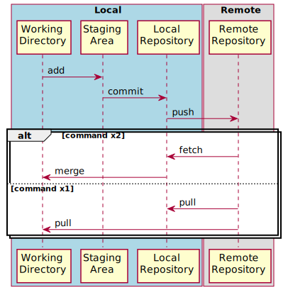

# git-sushi

本リポジトリには予め以下のブランチを作成しています。これを元に、コース内で紹介する様々な課題に取り組み Git における基本操作をマスターします。 学習を始める際は、GitHubにアカウントを作成後、適宜、本リポジトリをforkした上で取り掛かってみてください。
尚、コミットを行う場合は、下記のブランチに紐づくコミットIDを破壊するようなことはせず、 **必ず新規ブランチを作成した上でコミットを行う** ようにしてください。

# Branches in git-sushi Repository

<!-- https://app.diagrams.net/#G1SvMt1Rapt5jHcqcyblvWrWl2t3FubBj8 -->

* ○はある時点の状態を示しています。
* ○の上にある文字列はブランチ名です。
* ○の下にある文字列はコミットIDです。
* コミットは矢印の方向に向かって行われています。矢印の根本は古く、矢印の先は新しいです。

# Git Repository Concept

# Terminology

### Branch

コミットID は、SHA1 という人間が覚えにくい文字列である。そんなコミットIDに人間にも分かりやすい名前を付けたものがブランチである。

### fast forward

そもそもの意味は "A control on a tape or video player for advancing the tape rapidly." で、 早送りのこと。

### fast forward な関係

あるブランチからあるブランチへのコミットの流れが **fast forward** のみで構成されるような関係。 **本リポジトリ内のブランチの関係図** で言うと、例えば、 **maguro** と **oyster** は fast forward な関係であると言える。しかし、 **crab** と **squid** は fast forward な関係であるとは**言えない**。

### fast forward なマージ

fast forward な関係のある2つのブランチがあるとき、古いブランチが新しいブランチの内容に追いつくことで、ブランチの状態を新しいものにすることを fast forwrad なマージと呼ぶ。

### Local Repository

目の前のリポジトリのこと。

### Remote Repository

目の前のリポジトリとは別の場所に存在するリポジトリのこと。通常、GitHub等のインターネット上にあるリポジトリを指すことが多いが、決してインターネット上になければならないわけではなく、自前のパソコンのファイルシステム上にあるリポジトリでもリモートリポジトリと呼ぶことはある。

### Repository

Git という便利な機能が利用して履歴を管理するできるプロジェクトのことである。

### SHA1

0から9までの数字とaからfまでの英文字を組み合わせ40桁並べた文字列。コミットIDの書式に使用される。

    $ git show
    commit e09921bba1db763543adebc1b1e7f0b5d9511c6e (HEAD -> init, origin/init, unagi, anago, aji)

### Staging Area

コミットと対象を置く場所のこと。

### Working Directory

作業を行う場所のこと。例えば、ファイルを変更した場合、Working Directory上のファイルを変更したことになる。

# Git Commands

## `--help` オプション

|項目|スコア|
|---|---|
|使用頻度|★★★★☆|
|重要度  |★★★★★|
|難易度  |★☆☆☆☆|

### 実行例

    $ git clone --help

### 解説

サブコマンド実行時に `--help` オプションを指定することで当該のサブコマンドのマニュアルを参照することができる。
使い方が分からない場合はこれをみれば解決できるので、ググる前に `--help` でマニュアルを確認する習慣を身に付けよう。

## `git add`

|項目|スコア|
|---|---|
|使用頻度|★★★★★|
|重要度  |★★★★★|
|難易度  |★☆☆☆☆|

### 実行例

    $ git status
    On branch master

    No commits yet

    Untracked files:
      (use "git add <file>..." to include in what will be committed)
            README.md

    nothing added to commit but untracked files present (use "git add" to track)

    $ git add README.md

    $ git status
    On branch master

    No commits yet

    Changes to be committed:
      (use "git rm --cached <file>..." to unstage)
            new file:   README.md

### 解説

作業ディレクトリ内で変更した内容を [`ステージング・エリア(Staging Area)`](https://git-scm.com/book/ja/v2/%E4%BD%BF%E3%81%84%E5%A7%8B%E3%82%81%E3%82%8B-Git%E3%81%AE%E5%9F%BA%E6%9C%AC) に追加する。要は、Gitの管理対象として追加するときに使用するコマンドである。

## `git blame`

|項目|スコア|
|---|---|
|使用頻度|★★★☆☆|
|重要度  |★★★★★|
|難易度  |★☆☆☆☆|

### 実行例

    $ git blame -L 1,10 package.json
    ^75897c2dc (Paul O’Shannessy 2013-05-29 12:46:11 -0700  1) {
    d982d5e153 (Paul O’Shannessy 2015-06-02 14:13:11 -0700  2)   "private": true,
    d9c1dbd617 (Dan Abramov      2017-10-19 00:22:21 +0100  3)   "workspaces": [
    d9c1dbd617 (Dan Abramov      2017-10-19 00:22:21 +0100  4)     "packages/*"
    d9c1dbd617 (Dan Abramov      2017-10-19 00:22:21 +0100  5)   ],
    ^75897c2dc (Paul O’Shannessy 2013-05-29 12:46:11 -0700  6)   "devDependencies": {
    c641b611c4 (E-Liang Tan      2020-08-20 23:47:16 +0800  7)     "@babel/cli": "^7.10.5",
    c641b611c4 (E-Liang Tan      2020-08-20 23:47:16 +0800  8)     "@babel/code-frame": "^7.10.4",
    c641b611c4 (E-Liang Tan      2020-08-20 23:47:16 +0800  9)     "@babel/core": "^7.11.1",
    1396e4a8f5 (Pascal Fong Kye  2020-08-29 22:03:23 +0200 10)     "@babel/eslint-parser": "^7.11.4",

### 解説

過去にコミットされているファイルを対象に、各行の内容が、いつ、誰が、どのコミットの時に実装したものなのかを見える化するコマンド。
もし、既存の機能を修正し、プルリクエストをする場合には、元々実装した人を巻き込でレビューをしてもらうと効果的だ。
尚、`blame`という名前が付いているが、過去の実装者を非難するために用いるためのものではない。

## `git branch`

|項目|スコア|
|---|---|
|使用頻度|★★★★★|
|重要度  |★★★★★|
|難易度  |★☆☆☆☆|

### 実行例

    $ git branch
      main
    * sim

### 解説

git では、必ずどこかしらのブランチ上で作業をすることになる。
そのブランチは、ある目的毎に作ることが多い。
作業をしていると、ブランチの行き来が発生するので、その行き来の際や、暫く離席して戻ってきた時に『いまどのブランチにいるんだっけ？』という時にこのコマンドを実行して現在のブランチを確認したりする。ところが、実際にこれを何度もやっていると腱鞘炎になってしまいそうになるので、環境変数 `PS1` に現在のブランチ名を表示するような工夫をしているプログラマは多い。

## `git branch -a --contains [<commit>]`

### 実行例

    $ git branch -a --contains 718059ed9d4198591391818348c8fda68154c7fb
    * main
      remotes/origin/HEAD -> origin/main
      remotes/origin/linting
      remotes/origin/main

### 解説

あるコミットIDを持つブランチを走査しブランチ名を特定したくなったらこれ。`-a` を指定すればリモートも対象となる。

## `git cherry-pick`

|項目|スコア|
|---|---|
|使用頻度|★☆☆☆☆|
|重要度  |★★★★★|
|難易度  |★☆☆☆☆|

### 実行例

    $ git cherry-pick -x 5880d7bd669744c8b0ad41b62ec0bcc619efd3ed
    [git-101 6190d0d96] Remove TestUtils dependency on event registry
     Author: Dan Abramov <dan.abramov@me.com>
     Date: Wed Jul 1 22:36:45 2020 +0100
     3 files changed, 109 insertions(+), 13 deletions(-)

### 解説

git の世界では、過去の全ての実装は必ずどこかのコミットIDと紐付いているのだが、あるコミットIDに紐づく実装を引用し、まだその実装を持たないブランチのコミットとして取り込みたいというケースは少なくない。そんな時に `git cherry-pick` で簡単に当該コミットの実装を取り込むことができる。
このように、将来、別の誰かが自分の実装を利用するケースを想定することも大事になるので、コミットの粒度を意識することが非常に重要になってくる。
コミットの粒度を綺麗にするには [`git rebase`](https://git-scm.com/docs/git-rebase)の習得が必須となる。

## `git checkout`

|項目|スコア|
|---|---|
|使用頻度|★★★★★|
|重要度  |★★★★★|
|難易度  |★★☆☆☆|

### 実行例

    $ git branch
    * main
      sim
    $ git checkout sim
    Switched to branch 'sim'
    Your branch is up to date with 'origin/sim'.
    $ git branch
      main
    * sim

### 解説

ブランチ間の移動で用いるコマンド。

## `git clean`

|項目|スコア|
|---|---|
|使用頻度|★★★☆☆|
|重要度  |★★★★☆|
|難易度  |★☆☆☆☆|

### 実行例

    $ git status
    On branch sim
    Your branch is up to date with 'origin/sim'.

    Untracked files:
      (use "git add <file>..." to include in what will be committed)
            foo.txt

    nothing added to commit but untracked files present (use "git add" to track)

    $ git clean -f
    Removing foo.txt

    $ git status
    On branch sim
    Your branch is up to date with 'origin/sim'.

    nothing to commit, working tree clean

### 解説

追跡していないファイルを削除するコマンド。ファイルを個別に削除しても同じことができるのだが、ファイルの数が膨大にある時でもこのコマンドなら一発で削除できるので絶対に覚えておくべきコマンドの1つである。

## `git clone`

|項目|スコア|
|---|---|
|使用頻度|★★★☆☆|
|重要度  |★★★★★|
|難易度  |★★☆☆☆|

### 実行例

    $ git clone git@github.com:facebook/react.git

### 解説

指定したリポジトリを手元に再現するためのコマンド。
ブランチも適宜デフォルトのものが自動生成される。

初学者を悩ませるナンバー1 コマンド。
開発チームにアサインされると、リポジトリへのアクセス権が渡されるので、速やかに `git clone` を実行してプロダクトの状況を把握することが必要となる。
尚、事前にサーバーサイドに ssh 公開鍵の登録が必要になることも多く、プロジェクトアサイン直後は `git clone` が上手くいかないということもよく起きる。そういう意味では、いわば git における `Hello, World!` 的なコマンドとも言える。

## `git commit`

|項目|スコア|
|---|---|
|使用頻度|★★★★★|
|重要度  |★★★★★|
|難易度  |★☆☆☆☆|

### 実行例

    $ git status
    On branch git-101
    Changes to be committed:
      (use "git restore --staged <file>..." to unstage)
            new file:   foo.md

    $ git commit -m "create an example markdown for git cheat sheet"
    [git-101 9cf5b967c] create an example markdown for git cheat sheet
     1 file changed, 0 insertions(+), 0 deletions(-)
     create mode 100644 foo.md

### 解説

ステージング・エリアにあげた内容をリポジトリに記録する。
コミットを行うことで１つの歴史が刻まれる。

## `git commit --amend`

|項目|スコア|
|---|---|
|使用頻度|★★★☆☆|
|重要度  |★★★★☆|
|難易度  |★☆☆☆☆|

### 実行例

    $ git commit --amend

### 解説

`amend`という文字の通り、`git commit` のメッセージを修正するもの。個人開発では使わないが、複数人開発ではコミットメッセージは重要になるので、タイポをした時などはこのコマンドで修正すると良い。

## `git config`

|項目|スコア|
|---|---|
|使用頻度|★★☆☆☆|
|重要度  |★★★★★|
|難易度  |★☆☆☆☆|

### 実行例

    $ git config --local core.editor 'code --wait'

    $ git config --list | grep core.editor
    core.editor=code --wait

### 解説

gitは任意のユーザ、特定のユーザ、リポジトリの各単位で設定ファイルを持っている。
この設定には上述のエディターの設定を始め、git操作を行うユーザの名前やメールアドレス、gitコマンドのエイリアス等を登録することができる。
gitを使い始める際には初期設定を行うことになるので、コマンド操作や、設定ファイルの場所について正確に知っておく必要がある。

## `git diff`

|項目|スコア|
|---|---|
|使用頻度|★★★★★|
|重要度  |★★★★★|
|難易度  |★☆☆☆☆|

### 実行例

    $ git diff cd0275dcb2daf93c1de6deb199e711171eaa8a96..5880d7bd669744c8b0ad41b62ec0bcc619efd3ed

### 解説

Gitで追跡対象としたファイルの差分、ブランチ間の差分、コミット間の差分などを表示する際に使う。尚、インデントがズレただけのつまらない差分は `-w` オプションを添えることでそのつまらない部分の差分が表示されなくなる。地味に便利なオプションでありいつも感動してしまうオプションである。

## `git fetch`

|項目|スコア|
|---|---|
|使用頻度|★★★★☆|
|重要度  |★★★★★|
|難易度  |★☆☆☆☆|

### 実行例

    $ git fetch
    remote: Enumerating objects: 1878, done.
    remote: Counting objects: 100% (1197/1197), done.
    remote: Total 1878 (delta 1197), reused 1197 (delta 1197), pack-reused 681
    Receiving objects: 100% (1878/1878), 2.58 MiB | 3.75 MiB/s, done.
    Resolving deltas: 100% (1429/1429), completed with 471 local objects.
    From github.com:ruby/ruby
       bffd6cbd97..26ffda2fd2  master     -> origin/master
       545d682071..951e1377c1  ruby_3_0   -> origin/ruby_3_0
       fb4df44d16..53f5fc4236  ruby_3_1   -> origin/ruby_3_1
     * [new tag]               v3_1_1     -> v3_1_1

### 解説

remoteのリポジトリをダウンロードする。よく `git pull` と混同する人がいるが、`git fetch` はダウンロードするだけで、作業ディレクトリーには影響を与えない。

## `git grep`

|項目|スコア|
|---|---|
|使用頻度|★★★★★|
|重要度  |★★★★★|
|難易度  |★☆☆☆☆|

### 実行例

    $ git grep React.Fragment packages/react/src/ReactElementValidator.js
    packages/react/src/ReactElementValidator.js:          'Invalid prop `%s` supplied to `React.Fragment`. ' +
    packages/react/src/ReactElementValidator.js:            'React.Fragment can only have `key` and `children` props.',
    packages/react/src/ReactElementValidator.js:      console.error('Invalid attribute `ref` supplied to `React.Fragment`.');

### 解説

文字列検索ができる。何もオプションを渡さなくてもリポジトリ内を再帰的に検索してくれるので非常に有り難い。
これを初めて使った時、便利過ぎてめちゃめちゃ感動したのを覚えている。

## `git init`

|項目|スコア|
|---|---|
|使用頻度|★☆☆☆☆|
|重要度  |★★★★☆|
|難易度  |★☆☆☆☆|

### 実行例

    $ git init
    Initialized empty Git repository in /Users/ham/tmp/foo/.git/

### 解説

リポジトリを作る。
このコマンドを実行することで `.git` というディレクトリが作られ、gitの様々な恩恵を受けることができる。

## `git log`

|項目|スコア|
|---|---|
|使用頻度|★★★★☆|
|重要度  |★★★★★|
|難易度  |★☆☆☆☆|

### 実行例

    $ git log --all --oneline --graph
    * 9cf5b967c (git-101) create an example markdown for git cheat sheet
    * 5880d7bd6 (origin/sim) Remove TestUtils dependency on event registry
    | * 92b5fa19e (origin/dependabot/npm_and_yarn/fixtures/expiration/urijs-1.19.8) Bump urijs from 1.19.0 to 1.19.8 in /fixtures/expiration
    | | * a752c6d49 (origin/dependabot/npm_and_yarn/fixtures/dom/urijs-1.19.8) Bump urijs from 1.19.2 to 1.19.8 in /fixtures/dom
    | |/
    | | * f6af4a85d (origin/dependabot/npm_and_yarn/fixtures/attribute-behavior/urijs-1.19.8) Bump urijs from 1.18.12 to 1.19.8 in /fixtures/attribute-behavior
    | |/
    | * f468816ef (origin/main, origin/HEAD, main) Fix false positive hydration warnings (#23364)
    | * 5d08a24c2 useId: Use 'H' to separate main id from hook index (#23363)
    | * 629036a9c Bump versions to prepare for rc.1 (#23362)
    | * 3a60844a0 Update error message for suspending at sync priority (#23361)

### 解説

git の履歴を閲覧したり、branchの依存関係をツリー構造で閲覧する時などに使う。
`git push` をする直前に、過去のコミットの内容を自己レビューするために`git log -p` を実行するのは習慣にしておくと良いだろう。

## `git ls-files`

|項目|スコア|
|---|---|
|使用頻度|★☆☆☆☆|
|重要度  |★★★☆☆|
|難易度  |★☆☆☆☆|

### 実行例

    $ git ls-files | grep -i exhaustive
    packages/eslint-plugin-react-hooks/__tests__/ESLintRuleExhaustiveDeps-test.js
    packages/eslint-plugin-react-hooks/src/ExhaustiveDeps.js

### 解説

リポジトリ内のファイル一覧(`.git`配下や`.gitignore`で指定されているものは除く)を取得できるコマンド。
例えば、上の実行例のように、ファイル名を部分的に覚えている時に『あの、exhaustiveなんちゃらファイルってなんてやつだったっけ？』みたいな時に使うと目的のファイルが見つかったりする。

## `git merge`

|項目|スコア|
|---|---|
|使用頻度|★★★★☆|
|重要度  |★★★★★|
|難易度  |★☆☆☆☆|

### 実行例

    % git merge --no-ff squash-example-with-rebase
    ".git/MERGE_MSG" 6L, 288B written
    Merge made by the 'recursive' strategy.
     index.html | 1 +
     1 file changed, 1 insertion(+)

### 解説

あるブランチの1つ以上のコミット履歴を自ブランチに一気に取り込む。
GitHub等のサービスで、あなたのプルリクエストが `master` や `main` ブランチに取り込まれるのは、サーバ側で `git merge` が実行されているからである。

## `git pull`

|項目|スコア|
|---|---|
|使用頻度|★★★★☆|
|重要度  |★★★★★|
|難易度  |★★☆☆☆|

### 実行例

    $ git pull
    remote: Enumerating objects: 679, done.
    remote: Counting objects: 100% (619/619), done.
    remote: Compressing objects: 100% (327/327), done.
    remote: Total 679 (delta 344), reused 505 (delta 268), pack-reused 60
    Receiving objects: 100% (679/679), 650.67 KiB | 1.03 MiB/s, done.
    Resolving deltas: 100% (357/357), completed with 19 local objects.
    From github.com:OAI/OpenAPI-Specification
       f0a6bef..68ed2e4  gh-pages              -> origin/gh-pages
     * [new branch]      main                  -> origin/main
     * [new branch]      mr/agenda-add-slide   -> origin/mr/agenda-add-slide
     * [new branch]      ncaidin-patch-1       -> origin/ncaidin-patch-1
     * [new branch]      ncaidin-patch-2       -> origin/ncaidin-patch-2
     * [new branch]      ncaidin-patch-3       -> origin/ncaidin-patch-3
     * [new branch]      update-respec-version -> origin/update-respec-version
     * [new branch]      v3.1.1-dev            -> origin/v3.1.1-dev
     * [new branch]      v3.2.0-dev            -> origin/v3.2.0-dev
     * [new tag]         3.1.0                 -> 3.1.0
     * [new tag]         3.1.0-rc1             -> 3.1.0-rc1
    Your configuration specifies to merge with the ref 'refs/heads/master'
    from the remote, but no such ref was fetched.

### 解説

リモートリポジトリからローカルリポジトリにダウンロードして、その内容を作業ディレクトリーにも反映する。
`main`ブランチや`master`ブランチのような、自分以外の誰かが変更をするようなブランチで行うことが多い。

## `git push`

|項目|スコア|
|---|---|
|使用頻度|★★★★★|
|重要度  |★★★★★|
|難易度  |★★☆☆☆|

### 実行例

    $ git push origin HEAD
    Enumerating objects: 22, done.
    Counting objects: 100% (22/22), done.
    Delta compression using up to 16 threads
    Compressing objects: 100% (7/7), done.
    Writing objects: 100% (7/7), 1.35 KiB | 1.35 MiB/s, done.
    Total 7 (delta 6), reused 0 (delta 0), pack-reused 0
    remote: Resolving deltas: 100% (6/6), completed with 6 local objects.
    To github.com:gipcompany/git-command-cheat-sheet
       6f7134df6..ed17686a9  HEAD -> master

### 解説

ローカルリポジトリをリモートリポジトリに反映する。
Fast Forward じゃないと `git push` はできない。この場合にどうしても `git push` したい場合は、リモートブランチを削除した上で `git push` するか `git push -f` で強制的に `git push` をすることになる。

## `git rebase`

|項目|スコア|
|---|---|
|使用頻度|★★★★★|
|重要度  |★★★★★|
|難易度  |★★★★☆|

### 実行例

    $ git show --oneline
    9cf5b967c (HEAD -> git-101) create an example markdown for git cheat sheet
    diff --git a/foo.md b/foo.md
    new file mode 100644
    index 000000000..e69de29bb

    $ git branch
      fix-bug-110
    * git-101
      main
      sim

    $ git rebase fix-bug-110
    Successfully rebased and updated refs/heads/git-101.

    $ git show --oneline
    56df6549a (HEAD -> git-101, fix-bug-110) test

### 解説

git では、ブランチの分岐元の起点をbaseとして、コミットを積み上げていくのだが、そのbaseを付け替えることを rebase (re-base とは再度(re)起点(base)するところから来ている)すると言う。起点が更新されるため、起点からHEADまでの既存のコミットIDとは異なるが付け替えられることとなる。この点が、mergeとrebaseの大きな違いの1つと言えるだろう。

## `git reflog`

|項目|スコア|
|---|---|
|使用頻度|★★☆☆☆|
|重要度  |★★★★★|
|難易度  |★★★★★|

### 実行例

    % git reflog
    46ec44e (HEAD -> reflog, origin/main, origin/HEAD, undo, main) HEAD@{0}: reset: moving to HEAD~1
    07e635f HEAD@{1}: commit: 大事な内容
    46ec44e (HEAD -> reflog, origin/main, origin/HEAD, undo, main) HEAD@{2}: checkout: moving from main to reflog

### 解説

git の様々な操作の履歴を参照できる。例えば、今まで積み上げてきたコミットを誤って削除したり、消してはいけなかったブランチを誤って消してしまった場合等に、この `git reflog` で履歴を見つつ、 `git reset` を行うことで過去の状態に戻すことができる。『やっべ、やっちまった！』といったシーンでも大丈夫！きっと この`git reflog`がそんな危機的状況からの救世主となってくれるはず。

## `git reset`

|項目|スコア|
|---|---|
|使用頻度|★★★☆☆|
|重要度  |★★★★★|
|難易度  |★★★★☆|

### 実行例

    % git reset --hard HEAD@{1}
    HEAD is now at 07e635f 大事な内容

### 解説

過去にgit で行った操作をキャンセルしたいというときに`git reset`は活用できる。また、他にも、 `git add` でステージング・エリア にあげたファイルを作業ディレクトリに戻す際にも使ったりする。
その他、いろいろな用途で使用するコマンドだが詳細については[公式リファレンス](https://git-scm.com/docs/git-reset)の方を確認して欲しい。

## `git restore`

|項目|スコア|
|---|---|
|使用頻度|★★★☆☆|
|重要度  |★★★☆☆|
|難易度  |★☆☆☆☆|

### 実行例

    $ git status
    On branch git-101
    Changes not staged for commit:
      (use "git add <file>..." to update what will be committed)
      (use "git restore <file>..." to discard changes in working directory)
            modified:   SECURITY.md

    no changes added to commit (use "git add" and/or "git commit -a")

    $ git restore .

    $ git status
    On branch git-101
    nothing to commit, working tree clean

### 解説

上の実行例の様に、指定のディレクトリ配下の変更点を元に戻すことができる。
元々は、これと同じことを`git checkout .`で行われてきたのだが（今でもできるが）、`git checkout`の機能が多機能過ぎたために、`git restore`という新たなサブコマンドとしてスピンアウトしたもののようで、結構新し目のコマンドである。ちなみにはむさんは`git checkout`派。

## `git revert`

|項目|スコア|
|---|---|
|使用頻度|★☆☆☆☆|
|重要度  |★★★☆☆|
|難易度  |★☆☆☆☆|

### 実行例

    $ git show c73d7182b2f061c547195b2bb82ddec0cb8fea0a
    commit c73d7182b2f061c547195b2bb82ddec0cb8fea0a
    Author: Vladimir Gorej <vladimir.gorej@gmail.com>
    Date:   Sat Feb 19 20:20:53 2022 +0100

        fix(build): do not pull whole highlight.js and refractor libs (#7852)

        Refs #7851

    diff --git a/src/core/syntax-highlighting.js b/src/core/syntax-highlighting.js
    index 25e7c311..86f79bd0 100644
    --- a/src/core/syntax-highlighting.js
    +++ b/src/core/syntax-highlighting.js
    @@ -1,5 +1,4 @@
    -import { Light as SyntaxHighlighter } from "react-syntax-highlighter"
    -
    +import SyntaxHighlighter from "react-syntax-highlighter/dist/esm/light"
     import js from "react-syntax-highlighter/dist/esm/languages/hljs/javascript"
     import json from "react-syntax-highlighter/dist/esm/languages/hljs/json"
     import xml from "react-syntax-highlighter/dist/esm/languages/hljs/xml"

    $ git revert c73d7182b2f061c547195b2bb82ddec0cb8fea0a

    $ git show
    commit 25bc1bd6238aa36e194585b2e11a12e72f836092 (HEAD -> git-101)
    Author: Atsushi Ishida <gipcompany@gmail.com>
    Date:   Sat Feb 26 22:35:08 2022 +0900

        Revert "fix(build): do not pull whole highlight.js and refractor libs (#7852)"

        This reverts commit c73d7182b2f061c547195b2bb82ddec0cb8fea0a.

    diff --git a/src/core/syntax-highlighting.js b/src/core/syntax-highlighting.js
    index 86f79bd0..25e7c311 100644
    --- a/src/core/syntax-highlighting.js
    +++ b/src/core/syntax-highlighting.js
    @@ -1,4 +1,5 @@
    -import SyntaxHighlighter from "react-syntax-highlighter/dist/esm/light"
    +import { Light as SyntaxHighlighter } from "react-syntax-highlighter"
    +
     import js from "react-syntax-highlighter/dist/esm/languages/hljs/javascript"
     import json from "react-syntax-highlighter/dist/esm/languages/hljs/json"
     import xml from "react-syntax-highlighter/dist/esm/languages/hljs/xml"

### 解説

上の実行例の様に、逆のコミットを生成することができる。
実装したけれども未だ必要ではなかった。でもコミット履歴は残しておきたい。という時に、逆のコミットを残したりする。
後で、`git rebase`でコミット履歴を綺麗にするつもりのブランチにおいて、そのブランチがマージされるまでの間に、例えば、また忘れて同じ実装をしてしまうことがないように、どんな変更があったのかを残しておきたい場合などに利用したりする。

## `git rm`

|項目|スコア|
|---|---|
|使用頻度|★★☆☆☆|
|重要度  |★★★★★|
|難易度  |★☆☆☆☆|

### 実行例

    $ git status
    On branch git-101
    nothing to commit, working tree clean

    $ ls
    Dockerfile              config                  flavors                 src
    LICENSE                 cypress.json            package-lock.json       swagger-config.yaml
    NOTICE                  dev-helpers             package.json            swagger-ui-dist-package
    README.md               dist                    release                 test
    SECURITY.md             docker                  renovate.json           webpack
    babel.config.js         docs                    snapcraft.yaml          whitesource.config

    $ git rm composer.json
    rm 'composer.json'

    $ git status
    On branch git-101
    Changes to be committed:
      (use "git restore --staged <file>..." to unstage)
            deleted:    composer.json

### 解説

`git add` の逆でGitの追跡対象から外す。
あまり使う機会は無いと思うが、例えば、間違って `.gitignore` に記載されるようなコミットされたくないファイル（`node_modules` 配下のファイルなど）がコミットされてしまった場合等に、それらを除去する時に使用する。

## `git show`

|項目|スコア|
|---|---|
|使用頻度|★★★★★|
|重要度  |★★★★★|
|難易度  |★☆☆☆☆|

### 実行例

    $ git show
    commit 25bc1bd6238aa36e194585b2e11a12e72f836092 (HEAD -> git-101)
    Author: Atsushi Ishida <gipcompany@gmail.com>
    Date:   Sat Feb 26 22:35:08 2022 +0900

        Revert "fix(build): do not pull whole highlight.js and refractor libs (#7852)"

        This reverts commit c73d7182b2f061c547195b2bb82ddec0cb8fea0a.

    diff --git a/src/core/syntax-highlighting.js b/src/core/syntax-highlighting.js
    index 86f79bd0..25e7c311 100644
    --- a/src/core/syntax-highlighting.js
    +++ b/src/core/syntax-highlighting.js
    @@ -1,4 +1,5 @@
    -import SyntaxHighlighter from "react-syntax-highlighter/dist/esm/light"
    +import { Light as SyntaxHighlighter } from "react-syntax-highlighter"
    +
     import js from "react-syntax-highlighter/dist/esm/languages/hljs/javascript"
     import json from "react-syntax-highlighter/dist/esm/languages/hljs/json"
     import xml from "react-syntax-highlighter/dist/esm/languages/hljs/xml"

### 解説

引数にコミットIDを渡すことで該当コミットの内容を表示することができる。引数を省略した場合は直近のコミットの内容が表示される。尚、`git diff` と同様にインデントの違いを無視するには`-w` を渡せば良い。

## `git stash`

|項目|スコア|
|---|---|
|使用頻度|★★★☆☆|
|重要度  |★★★☆☆|
|難易度  |★★★☆☆|

### 実行例

    $ git status
    On branch master
    Changes not staged for commit:
      (use "git add <file>..." to update what will be committed)
      (use "git restore <file>..." to discard changes in working directory)
            modified:   Brewfile

    no changes added to commit (use "git add" and/or "git commit -a")

    $ git stash
    Saved working directory and index state WIP on master: ad346a0 init

    $ git status
    On branch master
    nothing to commit, working tree clean

    $ git stash pop
    On branch master
    Changes not staged for commit:
      (use "git add <file>..." to update what will be committed)
      (use "git restore <file>..." to discard changes in working directory)
            modified:   Brewfile

    no changes added to commit (use "git add" and/or "git commit -a")
    Dropped refs/stash@{0} (2fdc421b8eda4723a5e3d8831a3d79ea600040bb)

### 解説

working directory の変更状態を退避することができる。このコマンドは開発中に緊急度の高いプルリクエストのレビュー依頼が飛んできた時に割り込みで対応する時に重宝する。しかし、このような状況ではない経験上使うことはあまりない。退避した内容を復元するには`git stash pop` を実行すれば良い。

## `git status`

|項目|スコア|
|---|---|
|使用頻度|★★★★★|
|重要度  |★★★★★|
|難易度  |★☆☆☆☆|

### 実行例

    $ git status
    On branch git-101
    Changes to be committed:
      (use "git restore --staged <file>..." to unstage)
            deleted:    composer.json

    Changes not staged for commit:
      (use "git add <file>..." to update what will be committed)
      (use "git restore <file>..." to discard changes in working directory)
            modified:   cypress.json

### 解説

作業ディレクトリーとステージング・エリアの状態を表示する。
`git commit` を行う前には必ず`git status`を行い、必要十分なものが ステージング・エリア に上がっているかどうかを確認するようにしよう。
尚、`git status`と毎回打つのは面倒なので、`git st`で表示できるよう、[`alias`](https://git-scm.com/book/en/v2/Git-Basics-Git-Aliases) を登録する人は多そう。

## `git tag`

|項目|スコア|
|---|---|
|使用頻度|★☆☆☆☆|
|重要度  |★★☆☆☆|
|難易度  |★☆☆☆☆|

### 実行例

    $ git tag
    2.3.14.github
    2.3.14.github2
    3.0.20.github1
       :
       :
       :

### 解説

リポジトリでOSSのライブラリを開発している時にはバージョン管理が必要になるのだが、そのバージョンに対応するcommitに対してtagという別名をgitでは付与することができる。逆に言うと、バージョンを厳密に管理しなければあまり使うことはない機能だったりもする。

#### 感想

<small>

<!--
https://tools.ikunaga.net/tweet-link/
-->

本資料がもし何かの役に立った！という折りには、是非Twitterでツイート頂けますと嬉しいです。
その際は、 ハッシュタグ [#はむさんのGit][twitter_tweet] と [@diveintohacking][twitter_tweet] を付けて頂けると、一目散に拝読しに駆けつけます！

</small>

[twitter_tweet]: https://twitter.com/intent/tweet?text=%40diveintohacking%20%23%E3%81%AF%E3%82%80%E3%81%95%E3%82%93%E3%81%AEGit%E3%82%B3%E3%83%9E%E3%83%B3%E3%83%89%E3%83%AA%E3%83%95%E3%82%A1%E3%83%AC%E3%83%B3%E3%82%B9 "Twitterでツイートする"

#### 免責事項

<small>

本資料に掲載している内容には細心の注意を払ってはおりますが、その正確性については一切保証するものではありません。 また、本資料に掲載する情報を利用して生じたあらゆる損害等に対しては、理由の如何に関わらず、はむさんのオンラインスクールは一切責任を負いません。 予めご了承ください。

</small>

#### 著作権

本資料の全ての情報（テキスト、画像等）の転載・転用・複製を固く禁じます。

<small>

© [はむさんのオンラインスクール](https://diveintohacking.com/) はむさん

</small>

